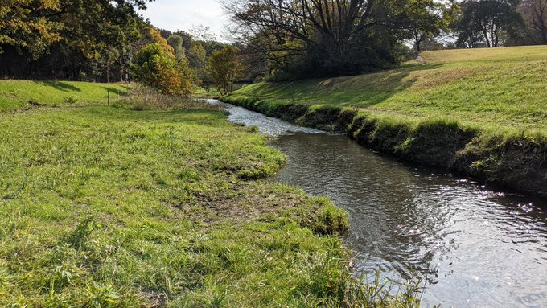
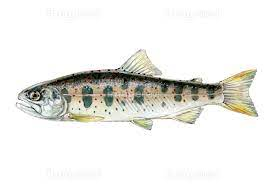

<!-- _paginate: false -->

# Marpでスライド作成テスト
## レイアウトを使いこなす
### 目次

1. 標準レイアウト（アマゴとヤマメ）
2. ２カラム表示用サンプルスライド
3. ３カラム表示用サンプルスライド
4. 質問と回答
<br/>

---

# （標準レイアウト）アマゴとヤマメ
## 生息域の違い
**アマゴ**
「太平洋に注ぐ西日本の河川」
**ヤマメ**
「太平洋に注ぐ東日本の河川」と「日本海側に注ぐ河川」
## 見た目の違い
よく似ているがアマゴには赤い斑点が散りばめられている
''

---
<style scoped>
.split-v>* {
  width: 100%;
} 
.split-v {
  align-items: flex-start;
} 
</style>

# ２カラム表示用サンプルスライド
<div class="split-v">
<div>

## Left Column
左右のカラムを均一に配置するために対象ページの冒頭に以下のスタイルを指定する

```
<style scoped>
.split-v>* {
  width: 100%;
} 
.split-v {
  align-items: flex-start;
} 
</style>
```

</div>
<div>

## Right Column
各カラムごとにdivで囲い込む

```
<div class="split-v">
テキスト
</div>
```

<div class="tweet">
あまり多くHTMLで指定すると「テキストの使い回ししやすさ」というMarkdown記法本来の良さが失われてしまうので注意
</div>
</div>

---

<style scoped>
.split-v>* {
  width: 100%
} 
.split-v {
  align-items: flex-start;
} 
</style>

# ３カラム表示用サンプルスライド
<div class="split-v">
<div>

## Left Column
divを3ブロックにすれば良いだけ

</div>
<div>

## Middle Column
テキスト

</div>

<div>

## Right Column

カラムレイアウトができると画像配置が捗って嬉しい
''
</div>

---

<style scoped>
h2::before {
  content: "Q. "
}
section > *:not(h1):not(header):not(footer) {
  font-size: 20px;
}
h3::before {
  content: "A. "
}
</style>

# 質問と回答

## このスライドをどうやってつくったの？

### Marpを使って作成しました。

基本的にはMarkdown記法で作成した簡単な構造のテキストをMarpでpptxスライドとして出力しただけですが、レイアウトを整えるためにCSSやHTMLも使用しています。
<br><br>

## 参考にしたサイトは？

### 「」を参考にしています。

一度、基本的なテンプレートを用意しておけば、あとはページごとに好きなレイアウトを選んでコンテンツを当てはめていくだけで統一感のあるスライドができそう。
<br><br>

---


